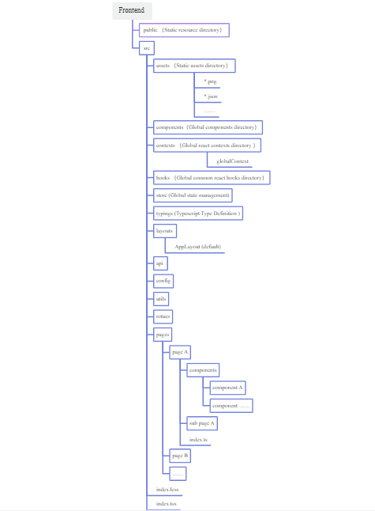
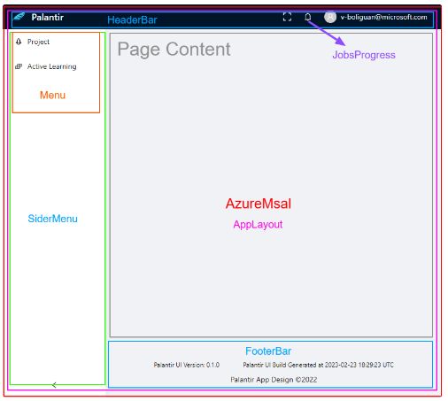
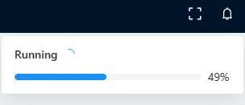
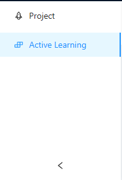
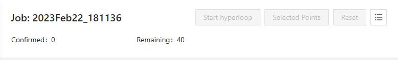

# Documentation for GPT-ALE UI 

## GPT-ALE UI  Directory List Introductions


## Layouts
### AppLayout


## Components

### AzureMsal 
Azure OAuth Component.
This component will create msalInstance from configuration files.


| Property      | Description | Type     | DefaultValue
| :---        |    :----:   |  :----:   |         ---: |
| enable      | Enable Azure OAuth       | boolean   | false|
| children   |         |    ReactNode   |

	
### FooterBar
This component will fetch UI version infor and build timestamp from configuration
			
### HeaderBar


This component contains JobsProgress component, and will fetch Job progress every 30 seconds.
			
### JobsProgress


This component will automatically fetch and persist job status in global storage.

			
### Loading


When routed to a new URI, a progress bar will show up.

```
nprogress.configure({
  easing: 'ease',
  speed: 500,
  showSpinner: false,
  trickleSpeed: 200,
  minimum: 0.3
})
```
### SiderMenu


This component displays and controls the content of the main menu. The width will automatically adjust when the screen width is less than 992px.

| Property      | Description | Type     | DefaultValue
| :---        |    :----:   |  :----:   |         ---: |
| collapsedWidth      | Width of collapsed sider       | number   | 48|
| siderWidth   |   Width of sider      |    number   |200|


### PagePanel


A header with common actions and design elements built in.

| Property      | Description | Type     | DefaultValue
| :---        |    :----:   |  :----:   |         ---: |
| className| Additional css class| string   | |
| style   |Additional style|CSSProperties|
| title   |The title element|string|
| subTitle   |The subtitle element|ReactNode|
| extra   |elements that will be rendered at the end of the title line|ReactNode|
| breadcrumb   |The props of breadcrumb component|BreadcrumbProps|
| body   |The body element|ReactNode|

## Config

```
const config: any = {
  API_PATH: process.env.API_PATH,
  AZURE_ENABLE: false,
  AZURE_TENANT_ID: '',
  AZURE_CLIENT_ID: '',
  VERSION: process.env.VERSION,
  GENERATED_TIME: process.env.GENERATED_TIME,
  msalInstance: null
}
```

## Contexts
### globalContext

Configure data correlation globally, data and methods can be configured per need.

| Property      | Description | Type     | DefaultValue
| :---        |    :----:   |  :----:   |         ---: |
| onSearch| Global search| (value: string) => void   | |


## Hooks

### useForceUpdate
Control Force update behavior 

Examples

```
import React, { useEffect } from 'react'
import { useForceUpdate } from '@/hooks'

let count = 0
export default () => {
  
  const forceUpdate = useForceUpdate()

  useEffect(()=> {
    setInterval(() => {
			count++;
      forceUpdate()
    }, 1000)
  } ,[])

  return <div>{count}</div>
}
```
Result
| Property      | Description | Type     | DefaultValue
| :---        |    :----:   |  :----:   |         ---: |
| forceUpdate| Force Update | ( )=> void   | |


### useFullScreen
Control the full screen behavior

Examples
```
import React, { useEffect } from 'react'
import { useFullScreen } from '@/hooks'

export default () => {
  const { fullScreen, toggleFullScreen } = useFullScreen()

  return <button onClick={toggleFullScreen}>{fullScreen}</button>
}
```
	
Result
| Property      | Description | Type     | DefaultValue
| :---        |    :----:   |  :----:   |         ---: |
| fullScreen| Full Screen Mode | boolean   |false |
| toggleFullScreen| | () => void	   | |


### uesStore 
Get global status store. 

Examples
```
import React, { useEffect } from 'react'
import { observer, useStore } from '@/hooks'

const page () => {
  const { globalStore } = useStore()

  console.log(globalStore)
  
  return <div></div>
}

export default observer(page)
```

Result
| Property      | Description | Type     | DefaultValue
| :---        |    :----:   |  :----:   |         ---: |
| globalStore| | GlobalStore   | |

## Routes
Configure front end routing rules.

```
import React, { lazy, ReactNode, Suspense } from 'react'

import type { RouteObject } from 'react-router-dom'

import Loading from '@/components/Loading'
import AppLayout from '@/layouts/AppLayout'

const Home = lazy(() => import('@/pages/Home'))

const List = lazy(() => import('@/pages/List'))

const Form = lazy(() => import('@/pages/Form'))

const Detail = lazy(() => import('@/pages/Detail'))

const Page403 = lazy(() => import('@/pages/403'))

const Page404 = lazy(() => import('@/pages/404'))

const ActiveLearning = lazy(() => import('@/pages/ActiveLearning'))

const Hyperloop = lazy(() => import('@/pages/Hyperloop'))

const Project = lazy(() => import('@/pages/Project'))

const ProjectDetail = lazy(() => import('@/pages/Project/Detail'))

const lazyLoad = (children: ReactNode): ReactNode => {
  return <Suspense fallback={<Loading />}>{children}</Suspense>
}

export const routers: RouteObject[] = [
  {
    path: '/',
    element: <AppLayout />,
    children: [
      {
        path: '/project',
        element: lazyLoad(<ProjectDetail />)
      },
      {
        path: '/project/:name',
        element: lazyLoad(<ProjectDetail />)
      },
      {
        index: true,
        path: '/activeLearning',
        element: lazyLoad(<ActiveLearning />)
      },
      {
        path: '/activeLearning/job/:id',
        element: lazyLoad(<Hyperloop />)
      },
      {
        path: '*',
        element: lazyLoad(<Page404 />)
      }
    ]
  }
]
```

### Store
### globalStore

| Property      | Description | Type     | DefaultValue
| :---        |    :----:   |  :----:   |         ---: |
| jobsCount|Count of available jobs | number   | 0|
| jobs| | JobProgress[]   | [] |
| isShowModal| | boolean   | false|
| getJobsProgress|Get JobProgress Data | () => void   | |
| showJobsDoneModal|When a job is 100% progress, a pop up will appear to navigate to the job page | () => void   | |
| setJobsCount|Set the number of jobs | (count: number) =>void   | |


## Utils
### getColor
Examples
```
import React, { useEffect } from 'react'
import { getColor } from '@/utils/color'

const page () => {
  const color1 = getColor('ABCDEFG')
  
  return <div style={{color: color1}}>{color1}</div>
}

export default observer(page)
```

| Property      | Description | Type     | DefaultValue
| :---        |    :----:   |  :----:   |         ---: |
| value|input string to hash | string   | ''|
| score|grayscale number | number   | 0|

Result
| Property      | Description | Type     | DefaultValue
| :---        |    :----:   |  :----:   |         ---: |
| color|Returns the hash in hex. | hex   | |

### http
double-sealed based on axios, simplify the api call, and add error handling.

Examples
```
import config from '@/config'
import http from '@/utils/http'

const API_PATH = `${config.API_PATH}`

export const getList = (): Promise<any[]> => {
  return http.get(`${API_PATH}/list`)
}

export const putData = (): Promise<any[> => {
  return http.put(`${API_PATH}/data`, {  name: 'name' })
}

export const postData = (): Promise<any[> => {
  return http.post(`${API_PATH}/data`, { id: 1, name: 'name2' })
}

export const deleteData = (): Promise<any[> => {
  return http.delete(`${API_PATH}/data`, { id: 1 })
}
```

| Property      | Description | Type     | DefaultValue
| :---        |    :----:   |  :----:   |         ---: |
| url|API url | string   | ''|
| data|API payload | any   | |
| config| | AxiosRequestConfig   | |

FYI, [AxiosRequestConfig](https://github.com/axios/axios)


## API
For API docs, check [here](https://palantir-demo-api.azurewebsites.net/api/docs)

## Pages
### Project Page


#### Components
LineChart
Show line charts in different dimensions

Props
| Property      | Description | Type     | DefaultValue
| :---        |    :----:   |  :----:   |         ---: |
| loading|Whether data is loading.| boolean   |false|
| data|| any   | |


Methods
| Property      | Description | Type     
| :---        |    :----:   |         ---: |
| legendAllSelect|Select all options in legend| () => void   |
| legendInverseSelect|Inverse select all options in legend | () => void   |


### ActiveLearning page


#### Components

JobTable

Display Job List 

Props
| Property      | Description | Type     | DefaultValue
| :---        |    :----:   |  :----:   |         ---: |
| loading|Whether data is loading.| boolean   |false|
| data|| any   | |

SearchBar


Props
| Property      | Description | Type     | DefaultValue
| :---        |    :----:   |  :----:   |         ---: |
| defaultValues|| SearchValue   ||
| onSearch|| (values: SearchValue) => void   | |

SearchValue
```
export interface SearchValue {
  project?: string
  keyword?: string
}
```

### Hyperloop Page


#### HyperloopContext 

Props

| Property      | Description | Type     | DefaultValue
| :---        |    :----:   |  :----:   |         ---: |
| loading|Whether the data is being loaded.| boolean   |false|
| points|All data points in the point cloud| ChoicePoint[] | Record<string, Point[]   | |
| choicePoints|Selected points| ChoicePoints[]   ||
| updateData|Annotation updates| Record<number, string>   ||
| categories|| Category[]   ||
| categorieNames|Name of all categories| string[]   ||
| occurance|heatmap related data| Record<string, Point>[]   ||
| transformations|Data to describe how data points moved| {   index: number      new_loc: number[]      old_loc: number[]    }[]   ||
| isFianl|If the annotation is finished.| boolean   |false|
| isStartHyperloop|If the annotation has been submitted| boolean   |false|
| mapGPT|Map to render GPT suggestions| Record<number, string>   ||
| onCreateCategory|Create new category| Record<number, string>   ||
| onChangeCategory|Modify existing category| (data: ChoicePoint, name: string) => void   ||
| onBrushselected|Get points within the selected area| (params: any, option: any) => void   ||
| onBrushEnd|Finish region selection.| (params: any) => void   ||


Schemas
```
export interface ChoicePoint {
  id: number
  text: string
  title: string
  label: string
  point: number[]
  score: number
  newPoint?: number[]
  newLabel?: string
  gpt?: string
  ann_by?: string
}

export interface Category {
  value: number
  name: string
  itemStyle: { color: string }
}
```
#### Components
* ScatterChart

  

  | Property      | Description | Type     | DefaultValue
  | :---        |    :----:   |  :----:   |         ---: |
  | className|| string   |''|
  | getPoint|Get info about a point by its id| (id: number) => void   ||

  Methods

  | Property      | Description | Type     | DefaultValue
  | :---        |    :----:   |  :----:   |         ---: |
  | showTooltip|Get tooltip for a single point| (id: number) => void   |''|
  | getPoint|Get tooltip about a point by its id| () => void


* Tooltip

  Display tooltip for a single point
  


* Pie Chart

  Show the distribution of all the categories in the upcoming batch.
  Data was fetched from HyperloopContext.

  

* Guide

  Guidance component to demonstrate basic usage.

  


    | Property      | Description | Type     | DefaultValue
    | :---        |    :----:   |  :----:   |         ---: |
    | show|| boolean   |false|
    | setPointPosition|Set the location of the hint red point| (values: SearchValue) => void|


* HeatmapChart

  Heatmap to show the confusion matrix. 
  


* DrawerPoints

  Show the most beneficial points selected by the teacher model.
  

* DrawerSelectPoints

  Show the list of points that was selected by user.
  
