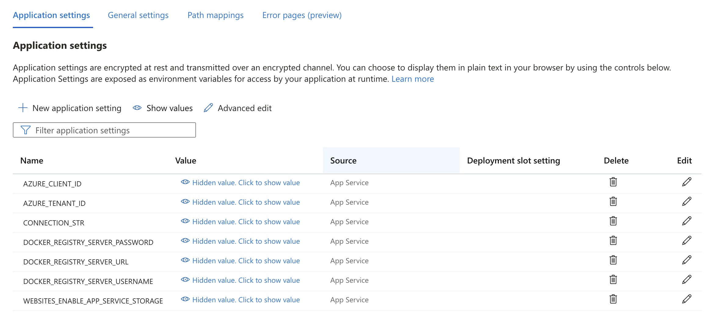

# Guidance to Provision Azure Resource for GPT-ALE

## Prerequisite
The provided Azure Resource Manager (ARM) template deploys the following resources, please make sure you have enough quota in the subscription and region you are deploying this in. You can view your quota and make request on Azure portal.

You need to have quota to provision the following resources:

1. An Azure Data Science Virtual Machine (Standard_D4s_v3, might scale up in future use)
1. An Azure Storage Account
1. Azure App Service and corresponding App Service plan


## Provision Azure Resources using ARM Template
1. Create an Azure Resource Group in the [Azure Portal](https://portal.azure.com).
1. Navigate to your Resource Group and click the **Create** Button, and select **template deployment (deploy using custom templates)** from Marketplace.
1. Click "Build your own template in the Editor", then paste the content of [this file](./setup_files/azure_provision.json) into the editor, then click "Save".
1. In "Basics" Tab, check all the resource names that is going to be used. You may have to change some names, if they are already taken by other users.
1. Add an Admin Password (and remember it)
1. Click “Review+Create”, then wait for the deployment to complete.

 
## Post-deployment configuration
### AAD configuration
1. Create an Azure Active Directory (AAD) application to enable authentication on the GPT-ALE UI (which gets created as part of the deployment script). Currently it is not possible to create one through ARM template but you can easily create one by running the following CLI commands in the [Cloud Shell](https://shell.azure.com/bash).

** Please make note of the Client ID and Tenant ID for the AAD app, you will need it in the ARM template deployment section.**

```bash

# Please don't change this name, a corresponding webapp with same name gets created in subsequent steps.
$sitename="<Name of the new WebApp>"

# Use the following configuration command to enable dynamic install of az extensions without a prompt. This is required for the az account command group used in the following steps.
az config set extension.use_dynamic_install=yes_without_prompt

# This will create the Azure AD application, note that we need to create an AAD app of platform type Single Page Application(SPA). By default passing the redirect-uris with create command creates an app of type web. Setting Sign in audience to AzureADMyOrg limits the application access to just your tenant.
az ad app create --display-name $sitename --sign-in-audience AzureADMyOrg --web-home-page-url "https://$sitename.azurewebsites.net" --enable-id-token-issuance true
```

After the above step, an AAD application will be created. Note that it will take a few minutes to complete, so make sure the `aad_clientId`, `aad_objectId`, and `aad_tenantId` below are not empty. If they are empty, re-run the three commands to refresh the values for `aad_clientId`, `aad_objectId`, and `aad_tenantId`, as they will be required later.

```bash
# Fetch the ClientId, TenantId and ObjectId for the created app
$aad_clientId=$(az ad app list --display-name $sitename --query [].appId -o tsv)

# We just use the homeTenantId since a user could have access to multiple tenants
$aad_tenantId=$(az account show --query "[homeTenantId]" -o tsv)

#Fetch the objectId of AAD app to patch it and add redirect URI in next step.
$aad_objectId=$(az ad app list --display-name $sitename --query [].id -o tsv)

# Make sure the above command ran successfully and the values are not empty. If they are empty, re-run the above commands as the app creation could take some time.
# MAKE NOTE OF THE CLIENT_ID & TENANT_ID FOR STEP #2
echo "AZURE_AAD_OBJECT_ID: $aad_objectId"
echo "AAD_CLIENT_ID: $aad_clientId"
echo "AZURE_TENANT_ID: $aad_tenantId"

# Updating the SPA app created above, currently there is no CLI support to add redirectUris to a SPA, so we have to patch manually via az rest
az rest --method PATCH --uri "https://graph.microsoft.com/v1.0/applications/$aad_objectId" --headers "Content-Type=application/json" --body "{spa:{redirectUris:['https://$sitename.azurewebsites.net']}}"
```

You may also manually fill in the values for `AZURE_CLIENT_ID` and `AZURE_TENANT_ID` in the WebApp Configuration as well. 

### WebApp configuration

The WebApp is configured to use a docker image from the Azure Container Registry (ACR). You can either build your own docker image and push it to your on ACR, or you can contact us for the password for our ACR.

To configure the WebApp to pull the docker image for gpt-ale, you need to go to `Settings -> Configuration -> Applications Settings` and review these settings:

| Key      | Value | Comment     |
| :---        |    :----:   |          ---: |
| DOCKER_REGISTRY_SERVER_URL        | palantirdemoacr.azurecr.io       | Replace w/ the name of your ACR, if you are not using ours |
| DOCKER_REGISTRY_SERVER_USERNAME   | palantirdemoacr                  | Replace w/ your username, if you are not using our ACR |
| DOCKER_REGISTRY_SERVER_PASSWORD   | intentionally_left_blank         | **REDACTED**, please contact GPT-ALE Project Team |

Alternative, you can configure the Web App to have ACR image pull permission. To do so, you need to go to `Settings -> Access Control (IAM) -> Add Role Assignment` and add the role `AcrPull` to the Web App's Managed Identity. Please be aware that it will give the Web App permission to pull any image from the ACR.



### Connection String for Storage Account

The connection string of the storage account need also be added to the WebApp's Configuration Section, with Key `CONNECTION_STR`. This should already be set correctly, but it may be worth reviewing it.

### Preparing Storage Blob Storage Container

Get into the storage account, and create a new blob container named `demo`.

